# KoshaDrive

**Версия:** `ver.13.04.2026`

## Скачать

Установщик: **[KoshaDriveSetup_13.04.2026.exe](https://github.com/kir-spec/KoshaDrive_releases/releases/download/ver.13.04.2026/KoshaDriveSetup_13.04.2026.exe)**

---

## О программе

KoshaDrive: Ваш персональный облачный диск

KoshaDrive помогает использовать ваш аккаунт Telegram как облачное хранилище, предоставляя удобный интерфейс для управления файлами.

Возможности программы:

Свобода действий

Инфраструктура Telegram предоставляет значительные ресурсы для хранения данных, а KoshaDrive делает их управляемыми.

Загружайте видео в высоком разрешении, образы дисков и архивы.

Храните документы, фотографии и резервные копии в одном месте.

Управляйте большими объемами данных без ограничений со стороны программы.

Организация файлов

Больше не нужно искать файлы в ленте сообщений. Виртуальная файловая система предоставляет следующие возможности:

Привычный интерфейс: работайте с файлами как в обычном проводнике Windows.

Древовидная структура: создавайте вложенные папки для удобного порядка.

Управление: добавляйте текстовые комментарии к файлам и выбирайте иконки для папок.

Приватность

Ваши файлы хранятся на серверах Telegram. Приложение спроектировано так, что доступ к структуре данных и файлам осуществляете только вы через свой аккаунт.

Интеллектуальная загрузка

Алгоритмы автоматически управляют фоновой загрузкой. При перетаскивании папки программа распределяет данные и загружает их в облако.

Работа в одном окне

Вы можете отправлять файлы своим контактам напрямую из интерфейса KoshaDrive. Встроенный чат позволяет делиться данными без необходимости открывать основное приложение мессенджера.

KoshaDrive позволяет удобно хранить файлы и организовывать их так, как вам нужно.

Связь с разработчиком - kvf_soft@mail.ru

---

## Установка

Скриншоты установки и первого запуска.

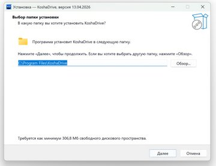

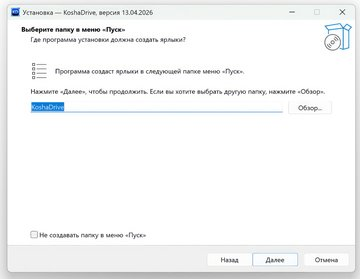

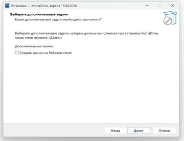

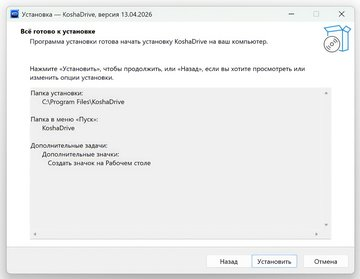

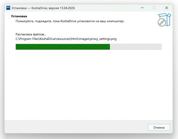

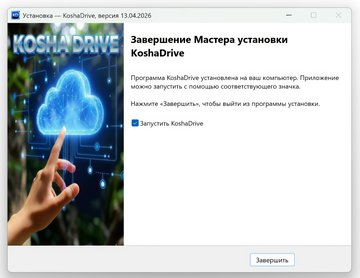

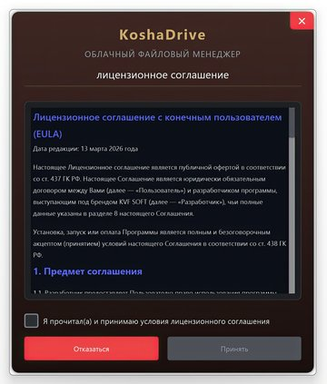

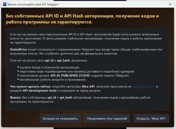

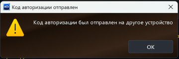

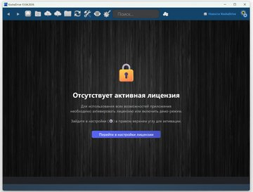

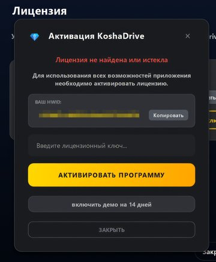

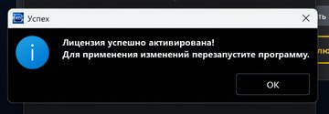

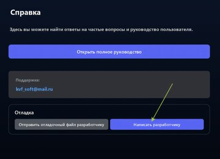

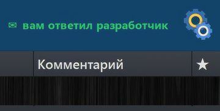

