

  

# KoshaDrive

**Версия:** `ver.13.04.2026`

## Скачать

Установщик: **[KoshaDriveSetup_13.04.2026.exe](https://github.com/kir-spec/KoshaDrive_releases/releases/download/ver.13.04.2026/KoshaDriveSetup_13.04.2026.exe)**

## Telegram и поддержка

- **Канал программы:** [@KoshaDrive](https://t.me/KoshaDrive) — новости и обновления
- **Чат пользователей:** [@KoshaDrive_chat](https://t.me/KoshaDrive_chat)
- **Написать разработчику:** [личные сообщения канала](https://t.me/KoshaDrive?direct) (кнопка «Написать» в профиле [@KoshaDrive](https://t.me/KoshaDrive))
- **Почта:** [koshadrive@gmail.com](mailto:koshadrive@gmail.com)

---

<strong>О программе KoshaDrive</strong> (нажмите, чтобы развернуть)

KoshaDrive: Ваш персональный облачный диск

KoshaDrive помогает использовать ваш аккаунт Telegram как облачное хранилище, предоставляя удобный интерфейс для управления файлами.

Возможности программы:

Свобода действий

Инфраструктура Telegram предоставляет значительные ресурсы для хранения данных, а KoshaDrive делает их управляемыми.

Загружайте видео в высоком разрешении, образы дисков и архивы.

Храните документы, фотографии и резервные копии в одном месте.

Управляйте большими объемами данных без ограничений со стороны программы.

Организация файлов

Больше не нужно искать файлы в ленте сообщений. Виртуальная файловая система предоставляет следующие возможности:

Привычный интерфейс: работайте с файлами как в обычном проводнике Windows.

Древовидная структура: создавайте вложенные папки для удобного порядка.

Управление: добавляйте текстовые комментарии к файлам и выбирайте иконки для папок.

Приватность

Ваши файлы хранятся на серверах Telegram. Приложение спроектировано так, что доступ к структуре данных и файлам осуществляете только вы через свой аккаунт.

Интеллектуальная загрузка

Алгоритмы автоматически управляют фоновой загрузкой. При перетаскивании папки программа распределяет данные и загружает их в облако.

Работа в одном окне

Вы можете отправлять файлы своим контактам напрямую из интерфейса KoshaDrive. Встроенный чат позволяет делиться данными без необходимости открывать основное приложение мессенджера.

KoshaDrive позволяет удобно хранить файлы и организовывать их так, как вам нужно.

Связь с разработчиком - koshadrive@gmail.com

---

<strong>Установка и первый запуск</strong> (нажмите, чтобы развернуть)

### Что понадобится

- Компьютер с **Windows 10 или 11**.
- Свободное место на диске (несколько сотен мегабайт).
- Аккаунт **Telegram** (телефон с установленным приложением Telegram).
- Права администратора на компьютере — обычно они уже есть у владельца ПК.

### Как скачать установщик

1. В разделе **«Скачать»** выше нажмите ссылку на файл `KoshaDriveSetup_….exe`.
2. Сохраните файл в удобную папку, например «Загрузки».
3. Если Windows спросит «Разрешить этому приложению вносить изменения?» — нажмите **«Да»**.

---

### Установка программы (мастер установки)

Ниже — порядок действий. На каждом шаге смотрите подсказки в окне установщика и нажимайте **«Далее»**, пока не дойдёте до копирования файлов.

**Шаг 1. Язык установки**  
Запустите скачанный файл двойным щелчком. В первом окне выберите язык (например, русский) и нажмите **«OK»**.

**Шаг 2. Папка для программы**  
Установщик предложит папку, куда будет установлен KoshaDrive (часто `C:\Program Files\KoshaDrive`). Обычно менять ничего не нужно — нажмите **«Далее»**. Если хотите другую папку — **«Обзор…»**, выберите папку, затем **«Далее»**.

**Шаг 3. Ярлыки в меню «Пуск»**  
Можно оставить настройки как есть и нажать **«Далее»**. Если ярлык в меню «Пуск» не нужен — снимите галочку «Не создавать папку в меню «Пуск»».

**Шаг 4. Значок на рабочем столе**  
При желании отметьте пункт про **значок на рабочем столе** — так программу будет проще найти. Нажмите **«Далее»**.

**Шаг 5. Проверка перед установкой**  
Просмотрите сводку (папка, ярлыки). Если всё верно — **«Установить»**. Если нужно что-то изменить — **«Назад»**.

**Шаг 6. Ожидание**  
Идёт копирование файлов. Дождитесь окончания — не закрывайте окно. На экране видно, что сейчас делает установщик и полоса прогресса.

**Шаг 7. Готово**  
Когда установка завершится, нажмите **«Завершить»**. Чтобы сразу открыть KoshaDrive, оставьте галочку **«Запустить KoshaDrive»**.

---

### Первый запуск (один раз после установки)

**Шаг 8. Лицензионное соглашение**  
При первом запуске прочитайте соглашение, поставьте галочку **«Я прочитал(а) и принимаю…»**, затем **«Принять»**.

**Шаг 9. API Telegram (по желанию)**  
Программа может предложить настроить свои **API ID** и **API Hash** Telegram — это для продвинутых пользователей. Можно нажать **«Продолжить без гарантий»** и настроить позже.

**Шаг 10. Вход в Telegram**  
Войдите так же, как в обычном Telegram: по **номеру телефона** или **QR-коду**. Если интернет через прокси — откройте **«Прокси»**, укажите настройки, **«Далее»**.

**Шаг 11. Код подтверждения**  
Если код пришёл в Telegram на телефоне или другом устройстве — откройте Telegram там, посмотрите код, введите его в KoshaDrive. Сообщение в программе можно закрыть кнопкой **«OK»**.

---

### Лицензия

**Шаг 12. Нет активной лицензии**  
После входа может появиться сообщение об отсутствии лицензии. Нажмите **«Перейти в настройки лицензии»**.

**Шаг 13. Раздел «Лицензия»**  
В настройках откройте **«Лицензия»**. Здесь можно **активировать ключ**, **купить лицензию** или включить **демо на 14 дней**.

**Шаг 14. Активация ключа**  
Скопируйте **HWID** из окна и отправьте разработчику (см. ниже). Полученный ключ вставьте в поле и нажмите **«АКТИВИРОВАТЬ ПРОГРАММУ»**. Пока ключа нет — можно включить демо.

**Шаг 15–16. После активации**  
При успехе программа попросит **перезапуск** — нажмите **«OK»** и запустите KoshaDrive снова. В настройках лицензии должен быть статус **«ЛИЦЕНЗИЯ АКТИВНА»**.

---

### Справка и связь с разработчиком

**Шаг 17.** В меню **«Справка»** — руководство, поддержка, кнопка **«Написать разработчику»**.  
**Шаг 18.** Ответ разработчика приходит уведомлением **«Вам ответил разработчик»** — нажмите, чтобы прочитать.

**Связь:** [канал KoshaDrive](https://t.me/KoshaDrive) · [чат пользователей](https://t.me/KoshaDrive_chat) · [написать разработчику в Telegram](https://t.me/KoshaDrive?direct) · почта koshadrive@gmail.com

---

### Скриншоты

Ниже — те же шаги в виде картинок. **Нажмите на миниатюру**, чтобы открыть полный размер.

<a href="docs/setup/full/setup_01.png" target="_blank" rel="noopener noreferrer">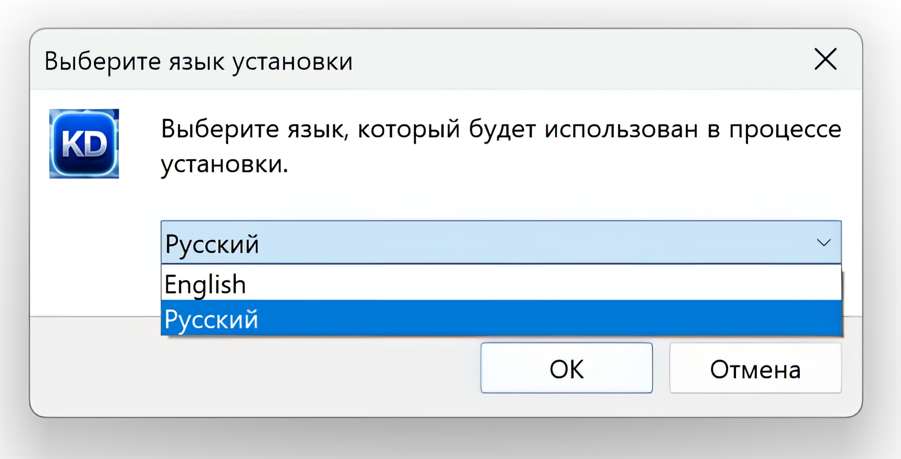</a>

<a href="docs/setup/full/setup_04.png" target="_blank" rel="noopener noreferrer">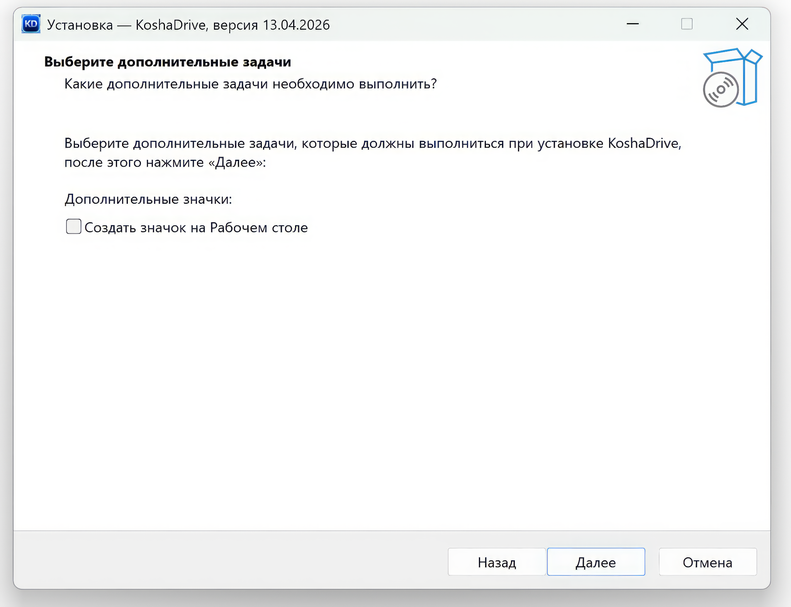</a>

<a href="docs/setup/full/setup_05.png" target="_blank" rel="noopener noreferrer">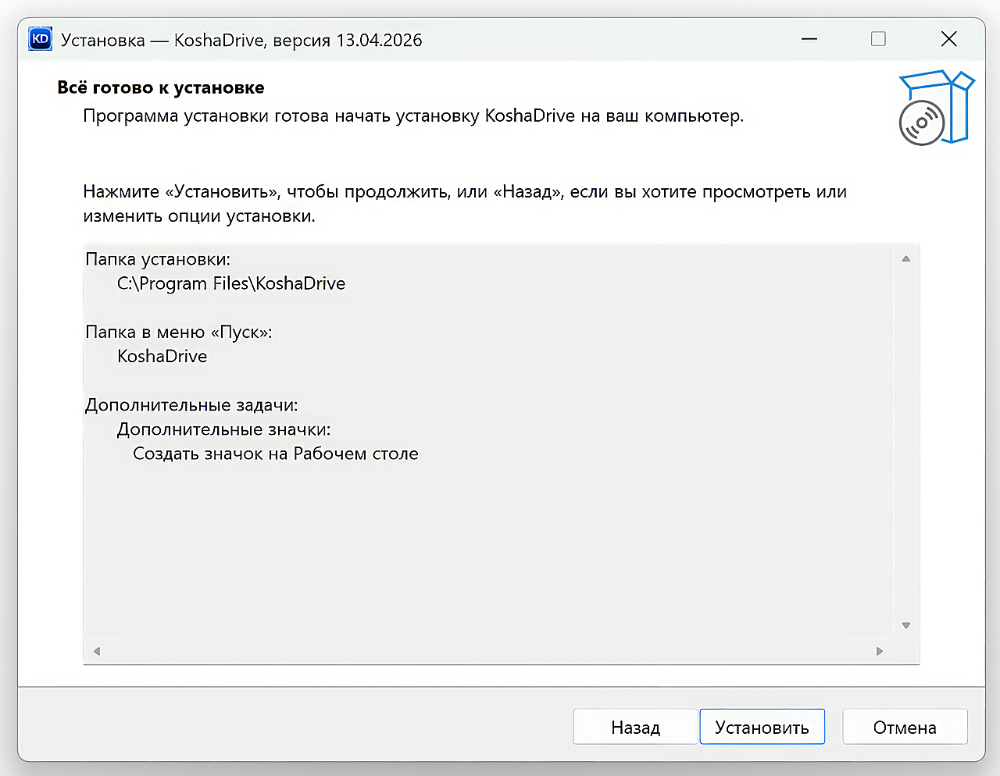</a>

<a href="docs/setup/full/setup_06.png" target="_blank" rel="noopener noreferrer">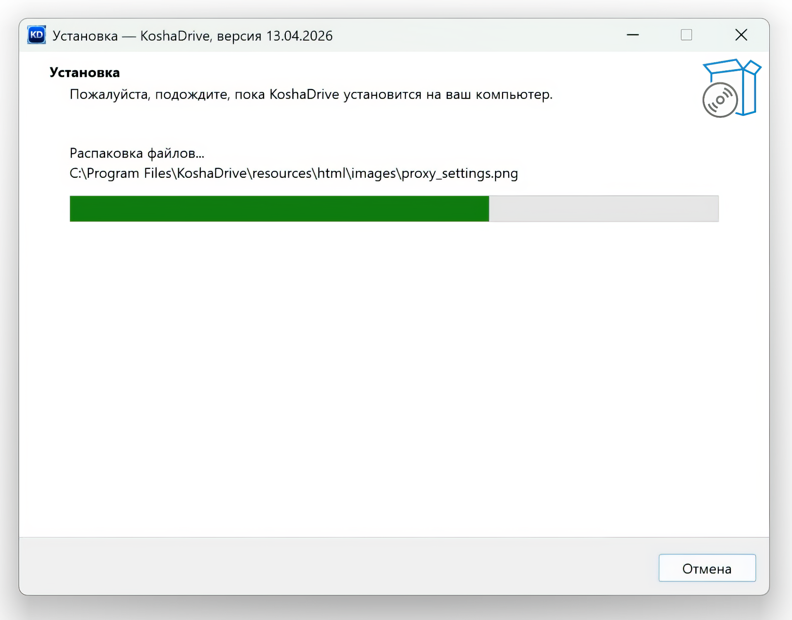</a>

<a href="docs/setup/full/setup_07.png" target="_blank" rel="noopener noreferrer">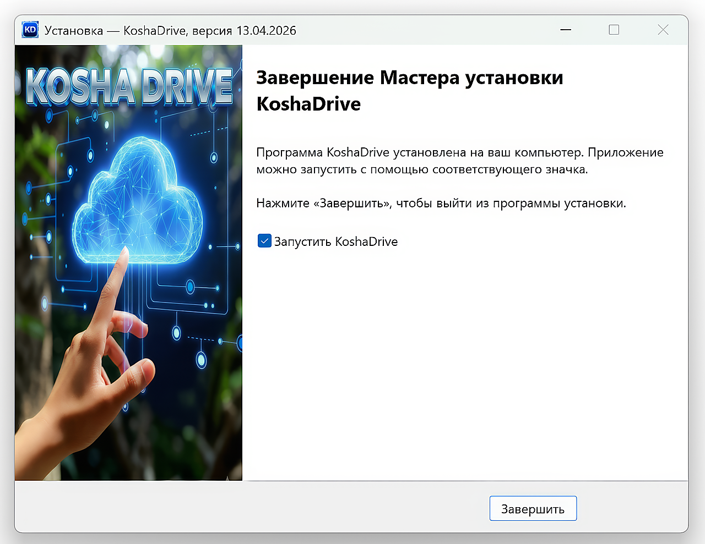</a>

<a href="docs/setup/full/setup_10.png" target="_blank" rel="noopener noreferrer">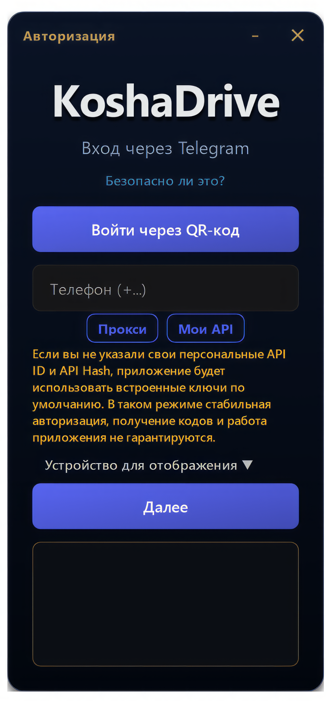</a>

<a href="docs/setup/full/setup_12.png" target="_blank" rel="noopener noreferrer">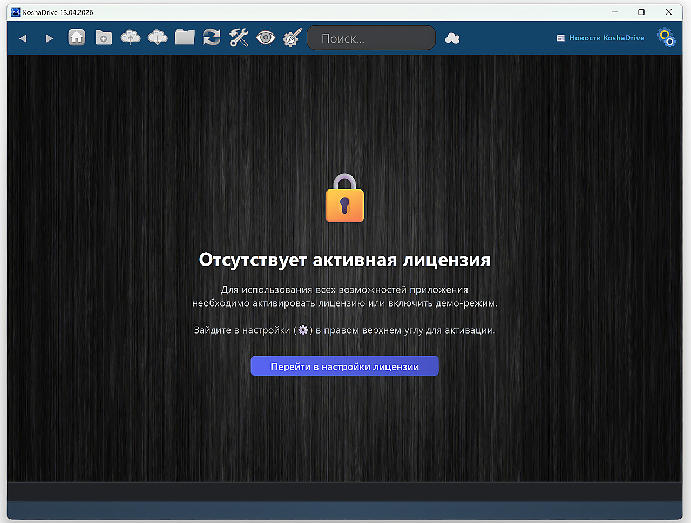</a>

<a href="docs/setup/full/setup_13.png" target="_blank" rel="noopener noreferrer">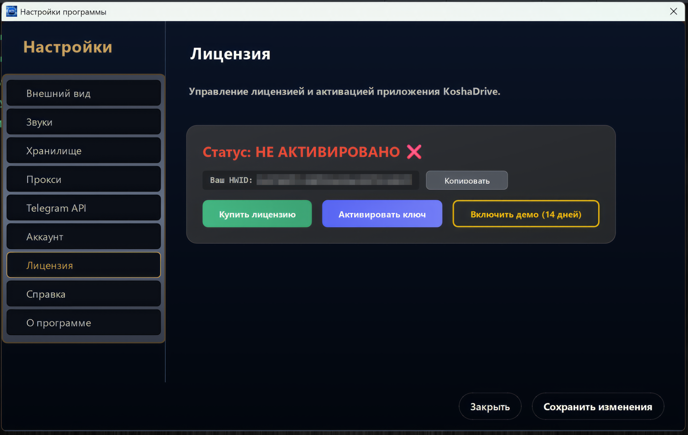</a>

<a href="docs/setup/full/setup_15.png" target="_blank" rel="noopener noreferrer">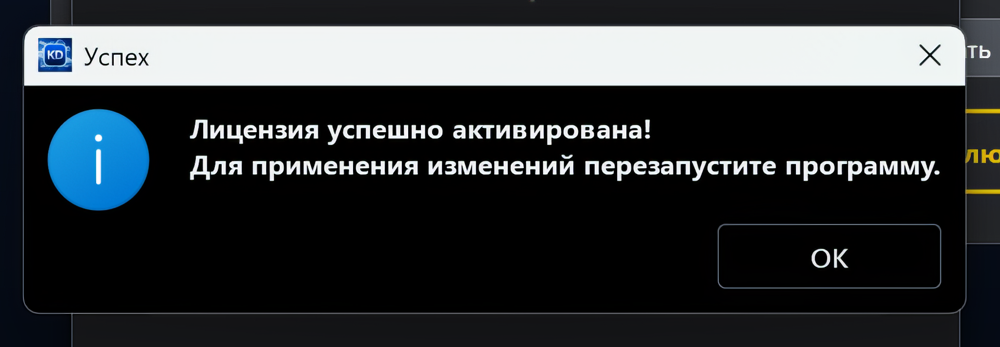</a>

<a href="docs/setup/full/setup_16.png" target="_blank" rel="noopener noreferrer">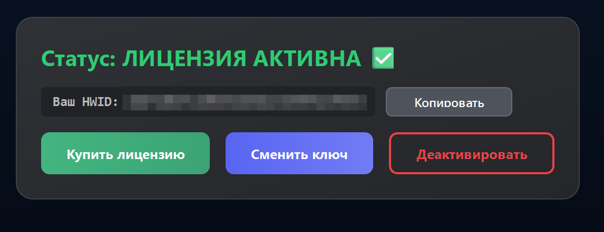</a>

<a href="docs/setup/full/setup_17.png" target="_blank" rel="noopener noreferrer">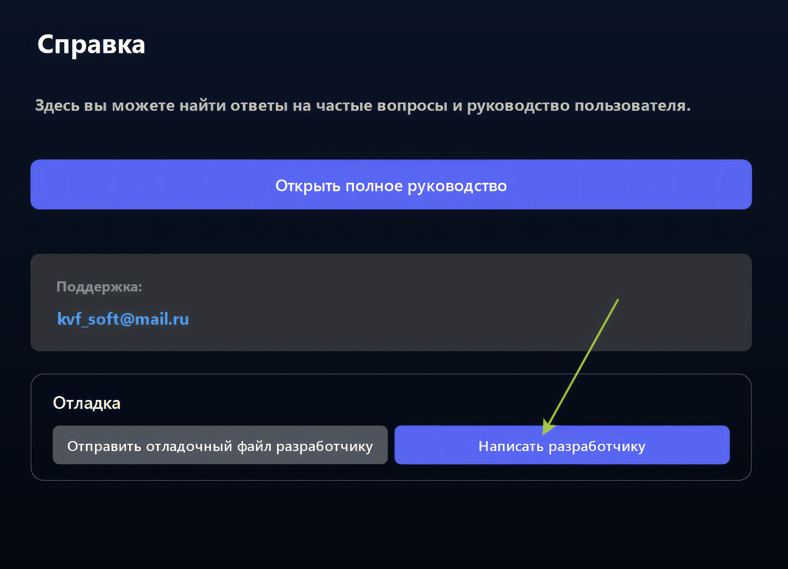</a>

<a href="docs/setup/full/setup_18.png" target="_blank" rel="noopener noreferrer">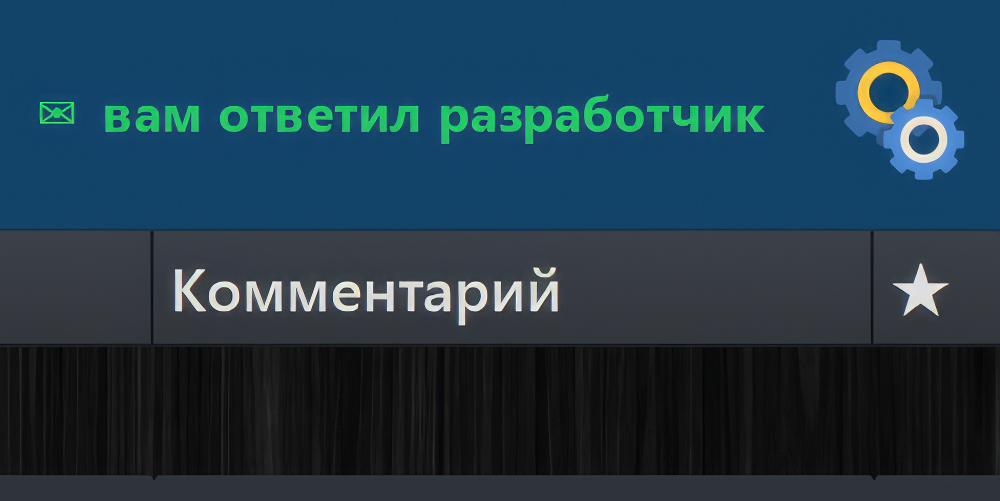</a>

